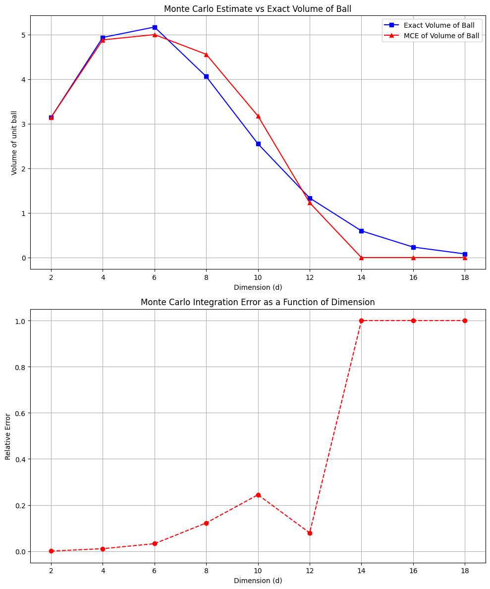

# Homework 1: Curse of Dimensionality  
**Author:** Ray Ding  


### 1. Identify some phenomenon that encounters the curse of dimensionality. That is some property that seems to be or clearly is easy in low-dimensions, and as it is generalized to high-dimensions where the dimension $d$ is a parameter, it becomes significantly harder as a function of $d$.

### (a) Mathematically define or describe the phenomenon you have identified.
In condensed matter physics, Monte Carlo simulation is a valuable technique to compute numerical solutions of complex problems, such as the Ising model. It approximates an integral by randomly sampling points within the domain and averaging the function’s values at these points. 

For a function $f(x)$ defined over a domain $\Omega \in \mathbb{R}^d$, the integral of $f$ over a domain $\Omega$ is:

$$I = \int_\Omega f(x) \, dx.$$

Monte Carlo estimates approximates it by sampling $N$ random points  $x_1, x_2, \ldots, x_N \in \Omega$ and computing:

$$
   \hat{I} = \frac{1}{N} \sum_{i=1}^N f(x_i).
$$

The standard error of this approximation is proportional to $\frac{1}{\sqrt{N}}$, which means it does not depend on the dimension $d$. This makes Monte Carlo estimation useful for high-dimensional problems. However, using Monte Carlo estimation to calculate the volume of the unit ball in high dimensions encounters the curse of dimensionality. The number of samples required to achieve accurate results grows significantly in high dimensions.


### (b) Show empirically some property getting harder as a function of $d$. This should be a plot or a table where you measure something for different values of $d$, and we can see how it gets harder as d increases. You only need to increase d large enough so that this effect becomes clear. Make sure the experimental set up is clear, and that all columns of a table or axis of a plot are clearly labeled and explained.

The first concept I learned from this course is volume of the unit ball. Contrary to the intuition from 2D and 3D, the unit ball's volume starts to decrease around $d$ = 8 and approaches to 0 as $d$ increases. 

The formula for the volume of the unit ball in $d$-dimensional space is:

$$
Vol_d = \frac{\pi^{d/2}}{\Gamma\left(d/2 + 1\right)}.
$$

I use Monte Carlo sampling to estimate the volume of the unit ball and obtain the relative error at different $d$. The experiment setups and calculations are demonstrated in Python, with the code shown below.

```python
import numpy as np
import pandas as pd
import matplotlib.pyplot as plt
from scipy.special import gamma

# Equation of volume from https://en.wikipedia.org/wiki/Volume_of_an_n-ball
def exact_volume_of_ball(d):
    return (np.pi ** (d / 2)) / gamma((d / 2) + 1)

# Monte Carlo estimation of the volume of a unit ball in d dimensions
def monte_carlo_ball_volume(d, n_points=10000):  
    points = np.random.rand(n_points, d) * 2 - 1  
    distances = np.linalg.norm(points, axis=1)    
    inside_ball = np.sum(distances <= 1)         
    cube_volume = 2 ** d  # the volume of the hypercube $[-1, 1]^d$, $Vol = 2^d$.                        
    estimated_volume = (inside_ball / n_points) * cube_volume  
    return estimated_volume

# Dimensions to test
dimensions = [2, 4, 6, 8, 10, 12, 14, 16, 18]
n_points = 10000
MC_volumes = []
ball_volumes = []
errors = []

# Calculate Monte Carlo estimation and errors for different dimensions
for d in dimensions:
    monte_carlo_volume = monte_carlo_ball_volume(d, n_points)
    MC_volumes.append(monte_carlo_volume)
    exact_volume = exact_volume_of_ball(d)
    ball_volumes.append(exact_volume)
    relative_error = abs(monte_carlo_volume - exact_volume) / exact_volume
    errors.append(relative_error)

# Create a DataFrame for visualization
df_monte_carlo = pd.DataFrame({
    'Dimension': dimensions,   
    'Volume of Ball': ball_volumes,
    'MC Volume of Ball': MC_volumes,
    'Relative Error': errors
})

display(df_monte_carlo)


plt.figure(figsize=(10, 12))  


plt.subplot(2, 1, 1) 
plt.plot(dimensions, ball_volumes, marker='s', linestyle='-', color='b', 
         label='Exact Volume of Ball')
plt.plot(dimensions, MC_volumes, marker='^', linestyle='-', color='r', 
         label='MCE of Volume of Ball')
plt.xlabel('Dimension (d)')
plt.ylabel('Volume of unit ball')
plt.title('Monte Carlo Estimate vs Exact Volume of Ball')
plt.grid(True)
plt.legend()

plt.subplot(2, 1, 2) 
plt.plot(dimensions, errors, marker='o', linestyle='--', color='r')
plt.xlabel('Dimension (d)')
plt.ylabel('Relative Error')
plt.title('Monte Carlo Integration Error as a Function of Dimension')
plt.grid(True)

# Adjust the layout and show the combined plot
plt.tight_layout()  
plt.show()
```

The table below shows the dependence of the volume of a ball on d, along with Monte Carlo estimate and relative error.

| Dimension (d) | Volume of Ball | MC Volume of Ball | Relative Error |
|---------------|----------------|-------------------|----------------|
| 2             | 3.141593       | 3.1436            | 0.000639       |
| 4             | 4.934802       | 4.8800            | 0.011105       |
| 6             | 5.167713       | 4.9984            | 0.032764       |
| 8             | 4.058712       | 4.5568            | 0.122721       |
| 10            | 2.550164       | 3.1744            | 0.244783       |
| 12            | 1.335263       | 1.2288            | 0.079732       |
| 14            | 0.599265       | 0.0000            | 1.000000       |
| 16            | 0.235331       | 0.0000            | 1.000000       |
| 18            | 0.082146       | 0.0000            | 1.000000       |

Figures are shown below.




The results clearly show that as $d$ increases, the relative error grows significantly, making the Monte Carlo method much less accurate in higher dimensions. As shown by the data, when $d$ reaches 14 or higher, the relative error becomes 1.0 that the estimate becomes meaningless.

### (c) Explain mathematically why the phenomenon gets harder as the dimension $d$ increases. This could be a formula describing it as a function of $d$ (which should grow with $d$).

Monte Carlo methods use random sampling, and the standard error decreases at the rate proportional as $\frac{1}{\sqrt{N}}$. However, in higher dimensions, the error grows quickly because it needs way more points to accurately sample the tiny area that the unit ball takes up inside the much larger hypercube. As the dimension $d$ increases, it gets really expensive and inaccurate to do Monte Carlo integration. Below are two explicit reasons:

- The volume of the unit ball gets smaller and smaller as $d$ goes up.
- In high dimensions, most of the unit ball’s volume is close to its surface, making it harder to get the actual volume with random sampling.

### 2. What is the volume of the maximum size $d$-dimensional hypercube that can be placed entirely inside a unit radius ($r$ = 1) $d$-dimensional ball?

A box $C = [-a/2, a/2]^d$, where $a$ is the edge length. \
The distance from origin to the corner is $\| 0 - (a/2, a/2, ..., a/2) \| = \sqrt{d(a/2)^2}$. \
To be inside the ball, the corner of the hypercube should not exceed the boundary of the unit ball, so $\sqrt{d(a/2)^2} \le 1$. \
The maximam edge length is $a = 2/\sqrt{d}$, and the volume of the maximum size $d$-dimensional hypercube is

$$V = (2/\sqrt{d})^d.$$


### 3. Consider two point sets $A = \{a_1,a_2,...,a_n\}$ and $B = \{b_1,b_2,...,b_n\}$ both in $\mathbb{R}^d$. Assume they are linearly separable, which means that there exists halfspace $h^∗$ (all points on one side of a ($d$−1)-dimensional hyperplane) that contains all of $A$ and none of $B$. In fact there may be many such halfspaces, and I want to be able to easily tell if another halfspace $h$ also linearly separates $A$ from $B$.

### (a) What is the minimal information I need to store about $A$ and $B$ so for a query halfspace $h$ I can tell if they are linearly separated by $h$?

The equations to tell that two sets of points could be linearly seperated by the hyperplane $h$ are:

$<a,w> + t < 0$ and $<b,w> + t > 0$,

where $w$ is the normal vector of $h$ and $t$ is the intercept of $h$.

Thus, the minimal information need to be stored is $w$ and $t$.


### (b) How would this change, if I was ok with having a weaker guarantee, as follows: I am allowed to say TRUE if $h$ separates at least a (1 − $\epsilon$)-fraction of the data in $A$ and $B$ (for $\epsilon \in$ (0, 1/4)) and I could sometimes be wrong, but I should be correct with probability at least 1 − $\delta$.

In this case, I need to add the number of points $N$ in both $A$ and $B$ that was on the wrong side of the hyperplane in the minimal information to satisfy Hoeffding's inequality (similar to Bernoulli RVs) that guarantee the probability condition. Below are the equation:

$Pr[ N/2n - 0 \geq \epsilon] \leq \exp(-2 \cdot 2n \cdot \epsilon^2 ).$

Fix $\exp(-2 \cdot 2n \cdot \epsilon^2 ) = \delta$, then we get $\epsilon = -1/2 \sqrt{\ln(\delta)/n}$.

To calculate $N$, we obtain $N/2n \leq \epsilon = -1/2 \sqrt{\ln(\delta)/n}$. 

Thus, $N \leq \sqrt{n\ln(1/\delta)}$


