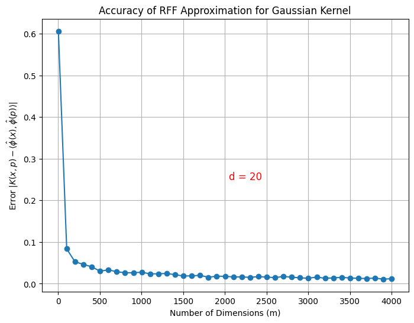

# Homework 2: Building Embeddings
**Author:** Ray Ding  

### 1. Implement either variant of Random Fourier Features to approximate the Gaussian kernel $K(x,p) = \exp(−\|x−p\|^2)$ for $x,p \in \mathbb{R}^d$. You can use code you find online, but you better be sure it is correct for this specific choice of kernel. Describe your implementation, and in particular which of the two main variants (cos and offset, or cos − sin) you use.

### Create a plot to assess the accuracy of these maps. The $x$-axis should show the number of dimensions you create m. The $y$-axis should measure the accuracy $|K(x, p) - \langle \hat{\phi}(x), \hat{\phi}(p) \rangle|$. Since this is a random process, you should somehow ensure you get an accurate representation of the performance in spite of the noise from randomness. The $x$-axis should start from $m$ = 2 and get large enough so that the error gets to about 0.01.

Random Fourier Features (RFF) with Cosine and Offset

To approximate the Gaussian kernel $K(x,p) = \exp(−\|x−p\|^2)$, I use the formula of RFF with cosine and offset

$$\hat{\phi}(x) = \sqrt{\frac{2}{m}} \cos(Wx + t),$$

where $x$ is the input vector with dimension $d$ = 20, $m$ is the number of dimensions I create, $W \in \mathbb{R}^{m \times d}$ is a matrix where each row $w_j$ is a random vector sample from a normal distribution $\mathcal{N}$(0, 1), and $t \in \mathbb{R}^m$ is a vector of offset, sampled from a uniform distribution $\text{Unif}[0, 2\pi]$.

Then the absolute error $|K(x, p) - \langle \hat{\phi}(x), \hat{\phi}(p) \rangle|$ was computed for $m$ from 2 to 4003 with 10 trials each to reduce the noise from randomness. The data is plotted int the below figure.




### 2. Consider a setting in $\mathbb{R}^2$. I want to learn a classifier defined by an ellipsoid, where points inside the ellipsoid are labeled  +  and points outside are labeled  -. If the task was to find a ball classifier, then I can do this with a lifting map to $D$ = 3 dimensions as: $\phi(x, y) = (x, y, x^2 + y^2)$, and then find a linear classifier of the lifted points. Describe the minimal dimensional lifting map $\phi : \mathbb{R}^2 \to \mathbb{R}^D$ (that is, where $D$ is as small as possible) such that in the $D$-dimensional space, the halfspaces could correspond with an ellipsoid in $\mathbb{R}^2$.

Ellipsoids are a specific type of quadratic boundary. In this case, $d$ = 2 and $p$ = 2, so the minimal dimensional lifting map has: 
$$
D = \binom{d + p}{p} = \binom{d + p}{d} = 6,
$$
$$
\phi(x, y) = (1, x, y, x^2, y^2, x y).
$$
Then use $\alpha = (\alpha_0, \alpha_1, \ldots, \alpha_5)$, \
and only need halfspaces with origin on boundary: \
$\langle \phi(x, y), \alpha \rangle \geq 0$.


### 3. Download or import a pre-trained word embedding model, such as GloVE (https://nlp.stanford.edu/projects/glove/) or word2vec of dimension at least 50. There are various ways to download and play with these. Specify which model you use. Measure the cosine distance between a large set of words, selecting some that you think are similar, and some very different. Determine and report a threshold $\tau$ in cosine distance where word pairs with cosine distance less than that value are “close” and ones greater than that value are “far”. Justify your answer. Explain how confident you are in this assessment; less convincing explanations may be docked a few points.

The model I used is GloVE with 50-dimensional embeddings. 

```
Loading GloVe model...
Loaded 400000 words.
Cosine distances for similar words:
king - queen: 0.2161
dog - puppy: 0.2245
car - automobile: 0.3044
man - woman: 0.1140
apple - fruit: 0.4082
cat - kitten: 0.3614
big - large: 0.3254
happy - joyful: 0.4450

Cosine distances for different words:
king - car: 0.7374
dog - banana: 0.6665
car - justice: 0.8428
apple - computer: 0.3597
happy - sad: 0.3109
man - banana: 0.7983
ocean - mountain: 0.3311
light - dark: 0.2698
```

 From the testing results, there are some interesting cases where words that are semantically opposite (like “light” and “dark”) or unrelated ("apple" and "company") have lower cosine distances than expected:

 -  light - dark: 0.2698 (although meanings are opposites, they’re closely related concepts)
 -  apple - computer: 0.3597 (possibly because “apple” is also associated with “Apple” as a tech company)

 So the GloVe model is designed to capture contextual similarity rather than just semantic differences, which explains the above results.
 I’m reasonably confident that the threshold $\tau$ is about 0.45.